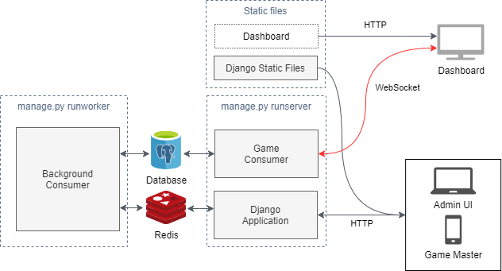

# musavisakisa

See related projects:

 * [ytmusicquiz][repo_ytmusicquiz] - Backend application: Admin UI, Game Master UI. Python / Django applcation.
 * [ytmusicquiz-dashboard][repo_ytmusicquiz_dashboard] - Game UI / Dashboard. React -application.
* [ytmusicquiz-deploy][repo_ytmusicquiz_deploy] - AWS Infrastructure as a code, written in Terraform.
* [ytmusicquiz-docs][repo_ytmusicquiz_docs] - Documentation: Written guidelines how to set up and develop the application.

# ytmusicquiz

This repository contains the backend application: Admin UI and Game Master UI. The application is written in [Python][python] using [Django-framework][django].

The communication between [the Dashboard application][repo_ytmusicquiz_dashboard] and the backend application uses WebSocket protocol. The application uses [Django Channels][django_channels]-framework to provide an easy abstraction layer using [Redis][redis] as a temporary backend storage and communication channel.

NOTE: Dashboard (or related static files) are not part of this repository, but illustrated here, because it's the user for WebSocket-connection.

The application also has support for running asynchronous background tasks for actions that takes a long time to complete. These use the same [Django Channels][django_channels]-framework to run these actions.

Currently, there is only one action supported: Importing a playlist from YouTube.

[python]: https://www.python.org/
[django]: https://www.djangoproject.com/
[django_channels]: https://channels.readthedocs.io/
[redis]: https://redis.io/
[repo_ytmusicquiz]: https://github.com/zcmander/ytmusicquiz/
[repo_ytmusicquiz_dashboard]: https://github.com/zcmander/ytmusicquiz-dashboard/
[repo_ytmusicquiz_deploy]: https://github.com/zcmander/ytmusicquiz-deploy/
[repo_ytmusicquiz_docs]: https://github.com/zcmander/ytmusicquiz-docs/